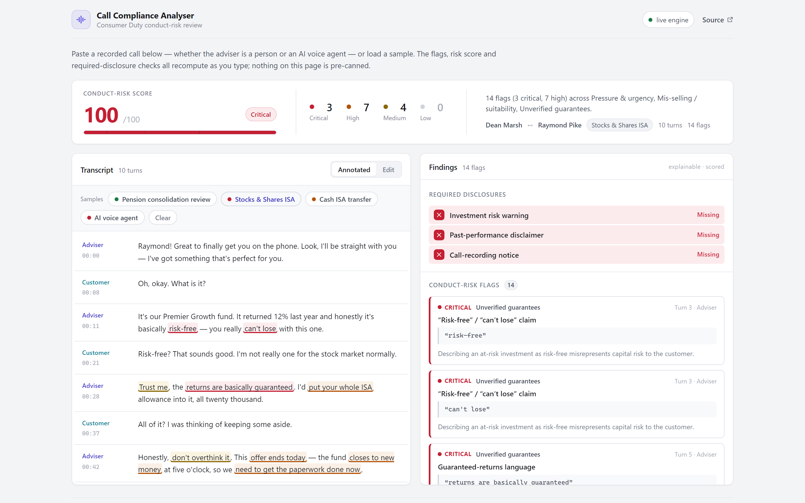
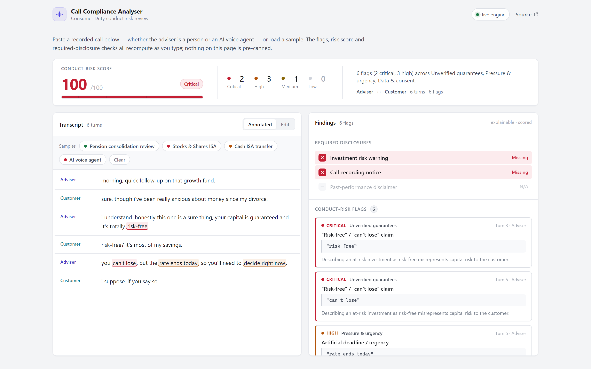

# Call Compliance Analyser — Consumer Duty conduct-risk review

Analyses a recorded **adviser ↔ customer call transcript** and flags the
**Consumer Duty conduct-risk** moments a UK compliance team cares about — with an
explainable, severity-scored report: every flag points at the **exact phrase**
that triggered it, its **category**, a **severity**, and a one-line **why**.

> **Live demo:** https://makingmofongo.github.io/aveni-compliance-demo/



**Paste any call and watch it re-analyse.** The detection engine is real, pure,
and unit-tested — it computes its output from the transcript text. The samples
and anything you type into the editor both flow through the **same**
`parseCall → analyzeCall` path, so nothing on the page is a canned result. Edit a
word and the flags, score and disclosure checks all recompute live:



Built as a working proof-of-concept that mirrors the call-analysis capability of
[**Aveni Detect**](https://aveni.ai/aveni-detect/) (automated QA & Consumer Duty
monitoring for wealth firms). The call transcripts are **sample data**; in
production these turns come from a speech-to-text pipeline (Deepgram / Whisper)
over the recorded call audio — the engine is unchanged.

---

## What it detects (and why a compliance team cares)

| Category | What fires it | Example flag |
|---|---|---|
| **Unverified guarantees** | "guaranteed returns", "risk-free", "can't lose" | *critical* — misrepresents capital risk (COBS fair-and-not-misleading) |
| **Missing risk disclosure** | an investment is discussed but **"capital at risk" is never said** | *high* — reasons over the **whole call**, not one phrase (COBS 14.3) |
| **Pressure / urgency** | "offer ends today", "decide now", "don't overthink it" | *high* — denies the customer time to consider |
| **Mis-selling / suitability** | "put your whole ISA in", "don't bother reading the small print" | *high* — concentration + blocking informed consent |
| **Vulnerable customer** | bereavement, confusion, low resilience, distress, health | *high* — the FCA's four drivers of vulnerability |
| **Data & consent** | no call-recording notice, asking for a full PIN/password | *medium/high* — UK GDPR & fraud red flags |

Each flag carries `{ category, severity, label, quote, why, turnIndex, start, end }`.
The `start`/`end` offsets slice **exactly** back to the triggering phrase — proven
by a unit test — which is what powers the inline highlighting in the UI.

The **missing-disclosure** checks are the interesting part: you can't catch a
*missing* disclosure with a keyword match. The engine detects that a *trigger*
appeared in the call (an investment was discussed, a past return was quoted) but
the *required* phrase never did — anywhere in the call.

---

## Four sample calls (deliberate contrast)

1. **Pension consolidation review** → **Low / pass.** Recording notice and risk
   warning given, no pressure, a minor accessibility need handled well. Score 8.
2. **Stocks & Shares ISA — high-growth fund** → **Critical.** Guarantees,
   manufactured urgency, concentration, no risk warning. Score 100.
3. **Cash ISA transfer — recently bereaved customer** → **High.** The adviser is
   *technically* compliant on disclosures, but three vulnerability signals
   (bereavement, confusion, low resilience) go unacknowledged — exactly the
   subtle failure a 3%-sampling QA misses. Score 54.
4. **AI voice agent — annuity sale** → **Critical.** The "adviser" is a
   production **AI voice agent**. The parser maps `Agent:` to the adviser role, so
   the *same* conduct rules govern the agent's call decisions — assurance over an
   automated agent, not just a human. Score 100.

---

## Paste your own (it's not faked)

The transcript editor is the source of truth. It accepts the formats real call
data comes in:

```
Adviser: this fund is basically risk-free, you really can't lose.
Customer: are you sure? it's all my savings.
Adviser: trust me — but the offer closes today, so you'll need to decide now.
```

Leading `[00:42]` timestamps, `[Agent]` brackets, `Client:` / `Caller:` synonyms
and diarised `Speaker 1:` labels all parse. Unlabelled prose is still analysed —
speaker-scoped rules fall back to firing so nothing is silently dropped. Edit a
sample or paste a brand-new call; the report recomputes on every keystroke.

---

## What's actually working (not faked)

| Capability | Where | Real? |
|---|---|---|
| Transcript parsing (labels, timestamps, roles, continuations, raw prose) | `src/engine/parser.ts` → `parseCall()` | ✅ tested, forgiving |
| Phrase-level conduct-risk detection w/ offsets | `src/engine/detector.ts` → `analyzeTurn()` | ✅ explainable rule scorer |
| Speaker-scoped rules (guarantee = adviser/agent, vulnerability = customer) | `src/engine/rules.ts` | ✅ |
| Negation handling ("returns are **not** guaranteed" → not flagged) | `detector.ts` | ✅ |
| Missing-disclosure reasoning over the whole call | `detector.ts` → `requiredDisclosures()` | ✅ absence detection |
| Weighted 0–100 risk score + band | `src/engine/util.ts` | ✅ |
| Inline highlight segmentation | `src/lib/highlight.ts` | ✅ pure, tested |
| Live call audio / STT | — | ❌ sample transcripts (wires to Deepgram/Whisper) |

Covered by **53 unit tests** (`npm test`): the parser turns varied real-world
transcript formats into the right turns, the detector classifies every sample
call into the right band, raises the right flags with the right quotes, scopes
rules by speaker, ignores negated statements, governs an AI agent's turns like an
adviser's, and the highlight segmentation reconstructs the original text exactly.

---

## Run it

```bash
npm install
npm run dev      # http://localhost:3000
npm test         # 53 engine + parser + UI unit tests
npm run build    # static export to ./out
```

Stack: **Next.js 14 (App Router) · React · TypeScript**, no UI dependencies.
Deployed as a static export to GitHub Pages via `.github/workflows/deploy.yml`.

---

## Wiring it to live calls

The engine is pure and side-effect free — `parseCall(text)` then
`analyzeCall(transcript)` are the only entry points — so it drops straight onto a
live pipeline:

- **Call audio → transcript:** Deepgram / Whisper streaming STT, diarised into
  adviser vs customer turns (the `Turn[]` shape the engine already takes).
- **Scale:** run `analyzeCall` per call in a worker; persist `ComplianceReport`
  for the QA queue, prioritised by `riskScore` and `band`.
- **Agent assurance:** the same rules score an AI voice agent's turns, so the
  governance layer covers automated callers, not just humans.
- **Model upgrade path:** the rule scorer is the bootstrap layer you ship before
  you have enough labelled audio. Swap individual categories for a fine-tuned
  classifier behind the same `Flag` interface without touching the UI.

---

*Built by Abdul Rasheed as a working proof-of-concept. Honest about what's
sample (the transcripts) and what's real (the engine). The compliance logic that
matters is genuine and tested.*
